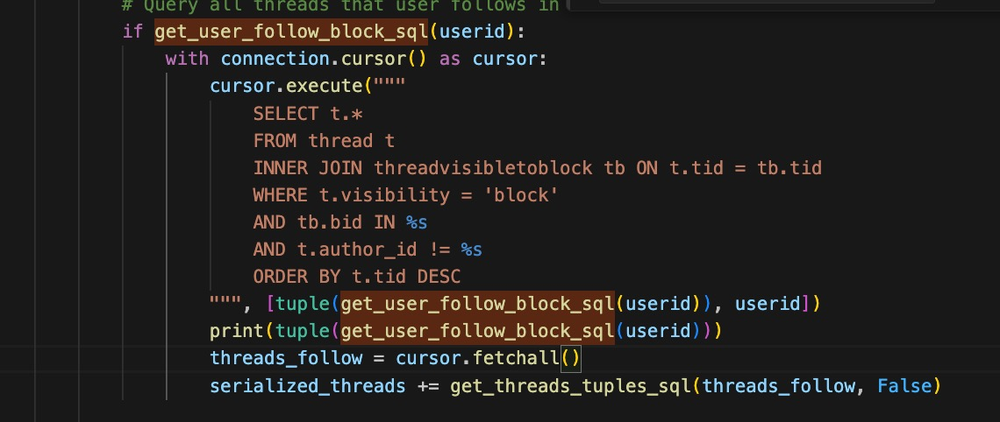
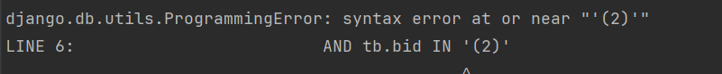

# Django
- [CORS](https://stackoverflow.com/questions/35760943/how-can-i-enable-cors-on-django-rest-framework)
- CSRF token
   
    when API POST
    1. avoid
        ```
        from django.views.decorators.csrf import csrf_exempt

        @csrf_exempt
        def your_func(request):
        # Your code here

        ```
    2. add token when post

        for frontend
        ```
        export function getCsrfToken() {
            const cookies = document.cookie.split(';');
    
            for (let i = 0; i < cookies.length; i++) {
                const cookie = cookies[i].trim();
                const cookieParts = cookie.split('=');
  
                if (cookieParts[0] === 'csrftoken') {
                    return cookieParts[1];
                }
            }
  
            return null;
        };

        // when POST REQUEST
        axios
            .post(YOUR_POST_API, {
            headers: {
                "x-csrftoken": getCsrfToken(),
            },
            withCredentials: true,
            })
            .then((response) => {
            // ...
            });
        ```
        [django in settings.py](https://docs.djangoproject.com/en/5.0/ref/settings/#csrf-cookie-secure)
        ```
        CSRF_COOKIE_SAMESITE = 'None'

        CSRF_COOKIE_SECURE = True

        CSRF_COOKIE_HTTPONLY = False

        CSRF_TRUSTED_ORIGINS = [
            # ...
        ]
        ```
        
- [Time zone](https://docs.djangoproject.com/en/5.0/topics/i18n/timezones/)
  
- Native SQL `IN`
  
  problem:

  func `get_user_follow_block_sql` return a list
  
  
  error when the list size is 1, in Django 5.04, not in 4.1
  

  solution: using direct sql rather than a func
  ```
  with connection.cursor() as cursor:
        cursor.execute("""
            SELECT t.* 
            FROM thread t
            INNER JOIN threadvisibletoblock tb ON t.tid = tb.tid
            WHERE t.visibility = 'block' 
            AND tb.bid IN (
                SELECT bid FROM user_follow_block WHERE uid = %s
                )
            AND t.author_id != %s 
            ORDER BY t.tid DESC
        """, [userid, userid])
    ```

  
- Know which user login in
  ```
    if request.user.is_authenticated:
        userid = request.user.id
  ```