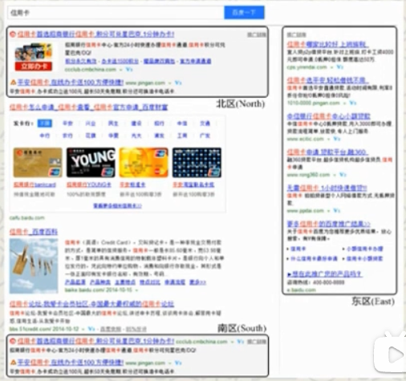

# 计算广告

- [计算广告](#计算广告)
  - [Intro](#intro)
    - [商业化相关问题](#商业化相关问题)
    - [免费模式](#免费模式)
    - [互联网三项可变现资产](#互联网三项可变现资产)
    - [行业协会](#行业协会)
      - [iab(Interactive Advertising Bureau)](#iabinteractive-advertising-bureau)
      - [American Association of Advertising Agencies](#american-association-of-advertising-agencies)
      - [Association of National Advertisers](#association-of-national-advertisers)
    - [数据](#数据)
      - [交易数据](#交易数据)
      - [行为数据](#行为数据)
    - [广告形式](#广告形式)
      - [偏直接效果型](#偏直接效果型)
      - [偏品牌触达型](#偏品牌触达型)
      - [移动广告](#移动广告)
      - [激励性广告](#激励性广告)
      - [泛广告商业产品](#泛广告商业产品)
    - [核心挑战](#核心挑战)
    - [如何标识一个用户？](#如何标识一个用户)
    - [用户模型的转化漏斗](#用户模型的转化漏斗)
    - [在线广告的主要结算方式](#在线广告的主要结算方式)
      - [CPA/CPS的问题与合理场景](#cpacps的问题与合理场景)
      - [CPA(cost per action) \& oCPM(optimize CPM)](#cpacost-per-action--ocpmoptimize-cpm)
  - [商业化体系](#商业化体系)
    - [商业化体系六大算法问题](#商业化体系六大算法问题)
    - [商业化体系六大产品问题](#商业化体系六大产品问题)
    - [商业化产品系统框架](#商业化产品系统框架)
      - [广告系统特点](#广告系统特点)
      - [后告系统有什么设计原则？](#后告系统有什么设计原则)
      - [开源软件的优势和顾虑](#开源软件的优势和顾虑)
      - [商业化产品系统架构统一框架](#商业化产品系统架构统一框架)
    - [商业化产品六大系统技术](#商业化产品六大系统技术)
    - [主要广告产品优化目标分解](#主要广告产品优化目标分解)
  - [theory](#theory)
    - [最优化问题](#最优化问题)
      - [无约束最优化问题](#无约束最优化问题)
      - [带约束最优化问题](#带约束最优化问题)
    - [文档的表示与相似度量](#文档的表示与相似度量)
  - [用户增长](#用户增长)
    - [基础：用户转化漏斗](#基础用户转化漏斗)
    - [找到增长障碍：多维报表分析](#找到增长障碍多维报表分析)
    - [驱动新产品特征：A/B测试](#驱动新产品特征ab测试)
  - [合约广告](#合约广告)
      - [广告位（CPT）合约](#广告位cpt合约)
      - [展示量合约与担保式投送](#展示量合约与担保式投送)
      - [多个合约如何满足：在线分配问题](#多个合约如何满足在线分配问题)
        - [流量预测](#流量预测)
        - [在线分配问题框架](#在线分配问题框架)
        - [在线分配典型问题](#在线分配典型问题)
      - [频次控制](#频次控制)
      - [Experimentation Framework](#experimentation-framework)
    - [用户画像](#用户画像)
      - [受众定向](#受众定向)
      - [行为定向](#行为定向)
    - [分布式计算平台](#分布式计算平台)
    - [合约广告优缺点](#合约广告优缺点)
    - [合约广告的利用和选择](#合约广告的利用和选择)
    - [广告监播](#广告监播)
    - [广告安全](#广告安全)
  - [竞价广告](#竞价广告)
    - [mechanical design](#mechanical-design)
      - [竞价交易问题](#竞价交易问题)
  - [搜索广告](#搜索广告)
    - [产品形式](#产品形式)
    - [计算概貌](#计算概貌)
  - [广告网络](#广告网络)
    - [产品策略](#产品策略)
    - [计算概貌](#计算概貌-1)
  - [算法技术](#算法技术)
    - [广告检索技术](#广告检索技术)
    - [短时数据统计与反馈](#短时数据统计与反馈)
    - [点击率预测](#点击率预测)
    - [搜索引擎营销](#搜索引擎营销)
    - [广告购买平台（Trading Desk）](#广告购买平台trading-desk)
    - [非RTB流量的ROI优化](#非rtb流量的roi优化)
  - [程序化交易](#程序化交易)
    - [程序化相关交易方式](#程序化相关交易方式)
      - [实时竞价](#实时竞价)
      - [优选（Preferred Deal）](#优选preferred-deal)
      - [私有市场（Private Marketplace, PMP）](#私有市场private-marketplace-pmp)
      - [程序化直投（PDB）](#程序化直投pdb)
    - [需求方平台](#需求方平台)
      - [定制化用户标签](#定制化用户标签)
        - [新客推荐（Look-alike）](#新客推荐look-alike)
      - [DSP](#dsp)
    - [供给方平台](#供给方平台)
    - [数据管理产品](#数据管理产品)
      - [第三方DMP](#第三方dmp)
      - [第一方DMP](#第一方dmp)
    - [数据交易](#数据交易)
    - [隐私保护和数据安全](#隐私保护和数据安全)
      - [差分隐私（Differential Privacy）](#差分隐私differential-privacy)
    - [流量保护和反作弊](#流量保护和反作弊)
      - [CPM/CPC广告监测](#cpmcpc广告监测)
      - [CPA/CPS广告归因](#cpacps广告归因)
      - [作弊方法](#作弊方法)
  - [原生广告](#原生广告)
    - [初级形式](#初级形式)
    - [移动广告](#移动广告-1)
      - [特点](#特点)
      - [挑战](#挑战)
      - [应用下载归因（Attribution）](#应用下载归因attribution)
    - [原生广告平台应该是什么样的？](#原生广告平台应该是什么样的)
    - [方向与挑战](#方向与挑战)

## Intro
### 商业化相关问题
+ 商业模式探索
+ 流量变现
+ 数据变现
+ 用户增长

### 免费模式
本质：能够个性化传播信息的产品，售价都会趋向其边际成本

example：
- 网站、应用：边际成本 $\approx$ 0
- 手机、电视：边际成本 $\approx$ 量产成本(举例：红米)

目的：获得其他资产，通过后向渠道变现

### 互联网三项可变现资产
- 品牌：根据用户熟悉的形象提高付费内容的**关注程度**
- 数据：根据用户偏好提高付费内容**投放效率**
- 流量：在正常(organic)内容里夹带**付费(sponsor)内容**

### 行业协会
#### iab(Interactive Advertising Bureau)
+ 在线广告供给方的行业协会，推动数字化营销行业的发展
+ 制定市场效果衡量标准和在线创意广告的标准
+ member: Google, Facebook, Yahoo, Microsoft
#### American Association of Advertising Agencies
+ 主要的协议是关于广告代理费用的收取约定，避免恶意竞争
+ 主要集中在创意和客户服务，在线业务是一部分
+ member: Ogilvy & Mather, JWI, McCann等，Dentsu等非4A会员的大公司但也被列为4A公司
#### Association of National Advertisers
+ 主要代表广告需求方的利益（也有媒体和代理会员）
+ member: AT&T,P&G,NBA etc

### 数据
#### 交易数据
业务流程中必须记录的数据

example
+ 电信：通话记录、话费
+ 银行：存取款、利息
+ 医疗：病例

特点
+ 数据规模中等
+ 一致性要求极高
#### 行为数据
业务流程中非必须记录的数据

example：
+ 互联网后台日志

特点：
+ 数据规模巨大
+ 一致性要求相对较低

### 广告形式
#### 偏直接效果型
+ Banner
+ Textual
+ Email Direct Marketing (EDM)
#### 偏品牌触达型
+ video ad
+ rich-media ad
+ 开屏广告
#### 移动广告
+ Banner
+ 开屏 (for branding)
+ 推荐墙
+ 信息流广告
#### 激励性广告
+ 下载返现
+ rewarded video(看视频得游戏道具)
#### 泛广告商业产品
+ 团购
+ 网址导航

### 核心挑战
计算广告的核心问题，是为一系列用户与环境的组合，找到最合适的广告投放策略以优化整体广告的利润

优化的是一组广告，主要是优化收入

$ eCPM = r(a,u,c) = \mu(a,u,c) \cdot v(a,u,c) $

$\mu(a,u,c)$ 点击率

$v(a,u,c)$ 点击价值

### 如何标识一个用户？
+ PC Web / Mobile Web环境 
    - cookie：存续性差，跨域时需要映射
+ iOS应用
    - IDFA：存续性好于cookie，但iOS10有更严格的政策(需要用户许可)
+ Android应用
    - Android ID： 存续性好于IDFA：
    - IMEI：在中国有部分使用
+ 无以上场景
    - FingerPrint (IP + User Agent): 存在http头中，可作缺省标识

### 用户模型的转化漏斗

### 在线广告的主要结算方式

CPC: 最主流，最合理，别的模式都需要第三方监控

CPS: cost per sale

#### CPA/CPS的问题与合理场景
存在的问题：
- 由供给方同时负责优化点击和转化率，并非普适的合理模式
- 存在劫持、代销等多种相应的灰色手段
- 用于优化的数据对于单个广告主来说严重不足
适用的场景：
- 转化流程一致且规范的广告市场
- 例：淘宝客（转化流程为淘宝统一提供）、APP下载（转化
流程在 Apple Store或 Google Play

#### CPA(cost per action) & oCPM(optimize CPM)
oCPM 按CPM结算，但不按CPM优化，按照CPA优化

## 商业化体系
### 商业化体系六大算法问题
A1: 特征提取
A2: 微观优化
A3: 宏观优化
A4: 受限优化
A5: 强化学习
A6: 重定向
### 商业化体系六大产品问题
+ 供需接口
    - 广告主（Campaign）概念上对应于广告主的一次投放合同，其中包括了预算、时间范围等基本信息。
    - 广告组（Ad Group）对应于一个具体的广告投放策略，主要是设定受众定向条件和出价。
    - 广告创意（Creative）则是最终展示出来的素材，可能在同一个组策略下有不同尺寸的创意存在。

+ 竞价机制
+ 数据运营
+ 标签体系
+ 程序化交易
+ 原生广告

### 商业化产品系统框架

离线处理：慢，但可处理数量小
在线处理：快，可处理数量大

Web-scale技术问题比较

#### 广告系统特点
+ 高并发、低延迟的要求
+ 同时关注QPS和Latency
+ 数据处理的规模很大
    -（用户、环境、信息）三元组上的数据建模
+ 数据处理的速度优先于精度
+ 主流程的一致性要求不高

#### 后告系统有什么设计原则？
+ 建立弱一致性系统的设计思维方式
    - eg: Near-line page fetcher
+ 大量数据尽量环形单向流动
    - 避免集中读写形成的单点性能瓶颈
+ 在线时不要发生与关系型数据库的交互
    - 增删改查的传统需求实际上不存在
+ 充分利用开源社区的成熟技术

#### 开源软件的优势和顾虑
优势
+ 大量细分使用场景都有开源方案
+ 大型互连网公司的开源产品经过充分测试

顾虑
+ 需要仔细甄别好的和不太好的开源项目
+ 在遇到深层次bug时无能为力

核心业务逻辑不应该选择开源，eg.排序,语义检索

#### 商业化产品系统架构统一框架

广告库和ETL使用了关系型数据库

Thrift: 协调不同coding language

商业化产品系统架构分解

### 商业化产品六大系统技术
+ 流量接入
    - 代码和SDK
+ 投放引擎
    - 高并发服务
+ 候选查询
    - 实时索引
+ 特征存储
    - Nosql database
+ 离线学习
    - 分布式计算
+ 在线学习
    - 流式计算

### 主要广告产品优化目标分解

## theory
### 最优化问题
#### 无约束最优化问题
$$ min f(x)$$
思路：
+ 目标函数不可/不易求导
  + 下降单纯形法(Ameoba变形虫法)
+ 目标函数易求导
  + 梯度下降法
  + 批处理模式：训练集上的梯度分解为各个样本梯度的和，可以并行实现
    + 牛顿法：先定方向后定步长
    + 拟牛顿法 (Hession不正定) BFGS,L-BFGS(省空间)
    + Trust region: 先确定步长后定方向
  + 串行模式：随机梯度下降法(SGD)
#### 带约束最优化问题
$$ min f(x)$$
$$ s.t. g(x)\leq 0, h(x) = 0$$
方法：
+ 拉格朗日法
### 文档的表示与相似度量
词袋(Bag of Words, BoW): 用关键词TF-IDF组成的矢量来表示文档
$$d = (x_{1},x_{2},...,x_{M})^T$$

TF-IDF:
    - TF: term frequency
    - IDF: inverse document frequency
  
$$IDF(m) = log(N/DF(m))$$

## 用户增长
### 基础：用户转化漏斗
- 原则：整个漏斗过程用于优化一个唯一的目标
- 作用：将该目标分解为若干比率的乘积，便于发现问题并优化
- 示例：
  
- 常见度量
  - 转化率：激活数与点击数的比
  - ｛次日/七日/月｝留存率：某日激活的用户中，｛次日/七日/月｝后活跃的用户占比
  - ｛日/月｝活跃用户（DAU, MAU）:每｛日/月｝活跃的独立用户数
  - 用户时长：每个活跃用产平均消耗的时间

### 找到增长障碍：多维报表分析
Data Cube：

什么是数据魔方？

用户可以较灵活选择维度组合，得到定制化报表;为人工决策提供便利

技术方案:
OLAP数据库

开源方案:
Saiku + MySQL

### 驱动新产品特征：A/B测试
多维情况下，魔方里大部分区域数据非常稀疏
- 极端情形：对于新Feature，需要主动分配测试流量
  
某维度上的两个选项（例如两个不同的模型），数据并不是完全可比，
因此，我们需要一个主动的A/B测试框架，以便
- 主动分配流量給新的产品特征
- 保证对比实验的各组在数据上完全可比
- 尽可能在同样的流量规模上容纳更多的实验
  
A/B测试并不是万能的

用户产品过于依赖数据会丧失对关键创新的把握
- 汽车无法从“跑得更快的马”进化而来（例：Zynga）

多数情形下，需要测试的可行组合太多，必须先经过人的筛选，或更复杂的E&E策略
- 例：每天数十万的新闻，哪些有可能最受用户欢迎？

博弈性场景无法通过A/B测试获得可靠结论

A/B测试最适合的场景：
理性产品、被动反应场景

## 合约广告
用户属性广告
#### 广告位（CPT）合约
与线下广告交易类似的传统模式

供给方产品：广告排期系统
- 帮助媒体自动执行多个合同的排期
- 广告没有复杂的动态决策，因此可以将素材直接插入页面

流量选择的维度
- 时间段、地域、轮播

典型场景
- 高曝光广告位，开屏广告，应用市场头部位置，导航网址

#### 展示量合约与担保式投送
展示量合约
- 基于合约的广告机制，有时未完成约定量要向广告商补偿
- 多采用千次展示付费（Cost per Mille, CPM）方式结算

担保式投送（Guaranteed Delivery, GD）引擎
- CPM方式要求广告投送由服务器端完成决策
- 三大技术基础：受众定向、流量预测、在线分配

典型场景
- 视频广告、富媒体广告、品牌条幅广告

展示量合约以人群为基础，更先进

防天窗广告：服务器down的时候的打底广告

只有CPT广告不用服务器，节约成本

#### 多个合约如何满足：在线分配问题
##### 流量预测
可视为query为a，对流量进行检索的反向查询问题

对供给节点进行倒排索引和查询的过程

预测过程
- 给定a，首先通过u的索引找出所有符合条件c的集合
- 对每个 $\mu$ 估计 $r(a,\mu)$ ，并根据 $p_{\mu}(eCPM)$ 得到a在 $\mu$ 上胜出的百分比p(a,2)，并将a的流量累加p(a,2) ・# $impression_{\mu}$ 
  
##### 在线分配问题框架

##### 在线分配典型问题

**基于对偶算法的紧凑分配方案**

紧凑分配方案（Compact Allocation plan）
- 变量数正比于|A|，而非|E|或|I|
- 分配策略最好是无状态的，这样可以避免服务器之间的同步

由 $\alpha$ 恢复 $\beta$ 和分配变量 $x$ ：

由历史数据求解上述问题规模太大，需要对数据作一些采样以便更高效地得到分配方案。

**启发式的High Water Mark算法**

离线规划
- 令每个供给节点i的剩余supply等于预测量 $r_{i} \leftarrow s_{i}$ 
- 将每个a按照I(a)中所有供给流量做升序排列，确定分配优先级
- 按照分配优先级对每个a解下式得到其投放率 $\beta_{a}$ ：
   $\sum _{a\in I(a)} min \{{r_i,s_i,\beta_i}\} = d_a$ 
- 对I(a)中的每个i，令 $r_i \leftarrow r_i - min{r_i,s_i\beta_a}$

在线分配

- 对某次展示, $\{a_1，…，a_J\}$ 为按照分配优先级排序的所有满足要求的广告
- 将上面的广告按投放率随机分配其展示机会

**NGINX**

轻量级Web服务器 / 反向代理服务器
- 专为性能优化面开发，可支持数万并发
- 内存和CPU占用较少

Nginx + FastCGI
将主要业务逻辑在FastCGI中用C语言实现

其他产品选择：Apache

**Zookeeper**
解決分布式应用中的一些数据管理问题
- 集群管理、分布式应用配置项的管理等
- 理论基础是著名的Paxos算法

集群管理
- 将宕机、网络断链、新机器加入等迅速通知每台Server并重新分配流量
- 用Zookeeper的Watch机制很容易实现

#### 频次控制
问题定义
- 限制各 $(a,\mu)$ 组合在一定时间周期的展示量

问题特性
- 频次存储的的规模是有上界的。 $(a,\mu)$ 组合总数不会超过时间周期内的展示总数。
- 生成用 $(a,\mu)$ 对应的key时，不需要处理冲突，因此不需要哈希结构。
- 专用的、轻量级的内存表比大多数No-SQL数据存储方案更实用。

CPM里频次控制很重要

#### Experimentation Framework
哪些场景需要线上A/B测试？
- 广告系统的升级
- 广告算法的改进
- 创意或定向策略的优化

实验框架的设计原则
- 任何一组对比实验，其他的条件都应该相同
- 线上流量容纳尽可能多的实验

### 用户画像
#### 受众定向

受众定向即为(a, M, C)打标签的过程
- 上下文标签可以认为是即时受众标签
标签的两大主要作用
- 建立面向广告主的流量售卖体系
- 为各估计模块（如CTR预测）提供特征
  

常见受众定向方式
+ 地域定向（Geo-targeting）
+ 人口属性定向（Demographical targeting）
  - 年龄、性别、教育程度、收入水平
  - 可监测，难获得，对效果意义有限
+ 频道定向（Channel targeting）
+ 精确位置定向（Hyper-local Targeting）
  - 利用蜂窝信息或者GPS获得精准位置，适用于020广告主）
+ 上下文定向、行为定向

  
受众定向标签体系
+ 结构化标签体系
  - 按照某分类法（Taxonomy）制定一个层次标签体系，父节点与子节点在人群覆盖上是包含关系。
  - 主要用于面向品牌广告的受众定向，特别常用于GD系统中。
+ 非结构化标签体系
  - 根据某类定向需求设置标签，标签并不能为同一个分类体系中所描述
  - 适用于多种目标、特别是效果目标并存的广告主的精准流量选择要求
- 关键词
  - 按照搜索或浏览内容的关键词划分人群
  - 非结构化，容易理解，但操作和优化不容易

标签体系一般设计思路

分行业制定标签体系
- 掌握各行业用户决策逻辑，依此制定标签体系
- 不必拘泥于完备的分类法（Ontology）

行业化标签体系举例
- 汽年行业：伱格→车型→品牌
- 电商行业：单品、单品、单品！
- 游戏行业：对每款游戏拓展竞品
- 母婴行业：孩子的年龄

**上下文定向**

根据用户正在浏览的页面和其他信息投送广告

举例：

地域定向、频道/URL定向，页面内容定向

常用方法：
- 用规则将页面归类到一些频道或主题分类
- 提取页面中的关键词
- 提取页面入链锚文本中的关键词
- 提取页面流量来源中的搜索关键词
- 用主题模型将页面内容映射到语义空间的一组主题上

半在线（Near-line）抓取系统

- 用在线cache系统存储url->特征表以提供实时访问
- 不预先加载任何cache内容，对cache中不存在的url，立刻返回空特征，同时触发相应的页面爬虫和特征提取
- 设置cache系统合适的失效时间以完成特征自动更

文本主题模型

问题：
- 发现一组文档中抽象的主题（topics）

输入：
- 一组文档： $\{ d_1,d_2,..,d_N \}$
- 文档矩阵： $\{n_{n1}, n_{n2},..., n_{nM}\}$
- 文档矩阵： $\{x_{nm}\}_{N \times M}$

输出
- 各文档得T个主题上的强度 $\{n_{n1}, n_{n2},..., n_{nT}\}$

常用文本主题模型
- LSA(Latent Semantic Analysis)
- PLSI(Probabilistic Latent Semantic Indexing)
- 词嵌入模型

#### 行为定向
决策行为
- 转化（Conversion）、预转化（Pre-conversion）
- 对应着非常明确的用户兴趣，价值最高

主动行为
- 搜索（Search）、广告点击（Ad click）、搜索点击（Search click）
- 在明确意图支配下主动产生的行为，价值也很高

半主动行为
- 分享（Share）、网页浏览（Page View）
- 量最大，用户意图较弱，但也有一定价值

被动行为
- 广告浏览（Ad View）
- 负面的加权因素

用户ID
- 最重要的数据，一串0前面的那个1
- 稳定、精确的用户ID能大幅提高行为数据使用效率

社交关系
- 可以用与用户兴趣的平滑：当某个人的行为不足，无法进行精准的行为定向时，可以考虑借鉴其社交网络朋友的行为和兴趣

行为定向建模

行为定向数据组织

Session log
- 将各种行为日志整理成以用户ID为key的形式，作为各数据处理模块的输入源，可以将targeting变成局部计算

行为定向两种长期特征累积方式
- 滑动窗方式
 $x'(d) = \sum^{D}_{\delta=0} x(d-\delta)$
- 时间衰减方式
 $x'(d) = \alpha x'(d-1) +x(d)$

人口属性定向

人口属性
- 由于监测的原因，实践中主要使用的是性别、年龄
- 在传统广告中为人群选择的主要语言

人口属性定向
— 以性别定向为例，为二分类问题

$g = arg max  _{g\in \{M,F\}} p(g|b)$

— 需要有一定数量的标注样本，特征则来自用户行

### 分布式计算平台

**FLUME**
- 高可用的，高可靠的，分布式的海量日志采集、聚合和传输的系统
- 数据源：console、text、 Thrift-RPC、tail, syslog
- 数据目的：console、dfs、Thrift-RPC, syslog TCP
- 其他产品选择
  - Scribe, Chukwa, KafKa

**Redis**
- 一个KV存储系统
  - Value可以支持string、list、set、zset、Hash
  - 支持push/pop、add/remove等操作示高性能，使用简单，提供多种语言API
- 注意事项
  - 避免让批量写影响在线服务中的读性能一尽量用自更新的方式减少数据输入
- 其他产品选择：Memcached
  
### 合约广告优缺点
优点
- 有投放量的保证，确保人群触达
- 有时可以有竞品排他服务
- 活动类营销可以利用CPT位置获得冲击式曝光

缺点
- 很难利用精细的用户数据
- 溢价相对较高，媒体作弊相对容易

### 合约广告的利用和选择
主要的合约广告产品
- 综合或垂直门户的首页广告位
- 视频网站贴片广告具
- 移动应用开屏广告

应该如何选择
- 宣传活动的品牌广告，可以选择高曝光的CPT广告 
- 日常品牌触达广告，可以结合受众购买CPM广告

### 广告监播
产品目的
- 广告主委托第三方公司，对实际发生的展示或点击数目进行核对
- 主要适用于按CPM结算的合约广告 
- 按CPC、CPA结算的效果广告对此需求不大

难点
- 人口属性、地域等的监测
- 样本与总体之间的校正

### 广告安全
广告投放验证（Ad verification）
- 确认品牌的安全性，防止广告出现在对品牌有伤害的页面上。（例：优衣库出现在钓鱼岛新闻上）
- 页面内容不符合品牌诉求，则展示与品牌无关创意
- 与广告监播不同，重点在于阻止不恰当展示的发生
- 可以Pre-bid进行

可视性（Viewability）验证
- 验证广告展示的曝光程度
- 判断浏览器是否对广告创意发生了渲染过

## 竞价广告
精细数据变现
### mechanical design
#### 竞价交易问题
将对象$a={1,2,...A}$排放到位置$s={1,2,...,S}$

对象a的出价(bid)为$b_a$，而其对位置s的计价为$r_{as}=\mu_{s}v_a$ ($\mu_1>\mu_2>...>\mu_s$)

v_a为点击价值，$\mu_s$从视为点击率

对称纳什均衡(Symmetric Nash equilibrium)
- $(vs - ps) x >= (vs - pt) xt$, 其中$pt = bs+1$
- 寻找收入最大化且稳定的纳什均衡状态是竞价系统设计的关键
- 微观上收少了，宏观上收多了
  
**广义第二高价和VCG**

广义第二高价（Generalized second pricing）机制
- 与VCG机制相比，会收取广告主更多的费用
- 整体市场不是truth-telling的
- 简单易行，为在线广告系统广泛采用
- CPM情形下：$q_s=b_{s+1}+1$
- CPC情形下：$q_s=r_{s+1}/\mu_s+1=\mu_{s+1}b_{s+1}/\mu_s+1$

VCG(Vickrey-Clarke Groves)
- 某对象的收费等于给他人带来的价值损害
- 整体市场是truth-telling的
- VCG<=广义第二高价
- 最早facebook使用
- 多个slot才有VCG, 单个slot退化为第二高价

**市场保留价和价格挤压**

市场保留价（Market Reserve Price, MRP）
- 即“底价”，出价高于MRP才能参与竞价
- 计费如果小于底价，按底价计费
- 可以根据不同竞价标的设置不同的底价
- 动态底价/静态底价

价格挤压
- $r=\mu v \rightarrow r=\mu_{\kappa}v$
- $\kappa$为正数：当其充分大时，只根据点击率排序，比如想净化市场，提高广告质量；当其接近0时，只根据点击单价排序，比如想提高收入

竞价广告普遍都是暗拍，即广告主不知道市场价格

## 搜索广告
最赚钱的广告产品

Google的创新
1. eCPM做排序，收入明显提升
2. 首先使用广义第二高价

### 产品形式
分为北(North)、东(East)、南(South)三个区域

广告一般带有底色

位置次序为：
- $North_1, North_2, ..., East_1,East_2,East_3, ...$
- 南区或重复北区、或重复东区

关键产品策略
- 查询扩展、广告排序、广告放置

### 计算概貌
优化目标：
$\underset{a_1,...,T}{max}\sum
\{\mu(a_i, c_i) • bid_{CPC}(a_i)\}$

关键特点：
- 搜索广告的变现能力即eCPM远高于一般显示广告
- 搜索广告的受众定向标签，即是上下文的搜索查询一搜索广告样式与自然结果的展示形式非常接近，有原生广告的意味
- 从搜索广告发展起来的竞价交易模式，已经逐渐发展
成为互联网广告最主流的交易模式

搜索广告系统架构

**查询扩展主要模式**
+ 精确匹配
  - 英语培训 -> {英语培训，培训英语}
+ 短语匹配
  - 英语培训 ->｛英语培训暑期班，哪个英语培训机构好，英语的培训，英语相关培训，培训英语,英文培训..｝
+ 广泛匹配
  - 英语培训 -> {外语学习班，四级证书，...}
+ 否定匹配

**查询扩展主要方法**
+ 基于推荐的方法
  - 在｛session, query｝矩阵上通过推荐技术来产生相关的关键词
  - 利用的是搜索的日志数据
+ 基于主题模型的方法
  - 根据文档主题模型，对某个查询拓展出主题相似的其他查询
  - 利用的是一般的文档数据
+ 基于历史效果的方法
  - 记录某些对特定广告主eCPM较高的关键词
  - 利用广告本身的历史eCPM数据

**广告位智能放置**

广告放置（Ad Placement）问题
  - 广告候选完成排序以后，需要分别确定北区和东区的广告条数

用户体验指标
  - 北区广告的平均条数，即North Foot Print（NFP）或Average Serving
Number(ASN)

广告放置策略优化
$$max \sum^T_{i=1}\{\sum^{n_i}_{s=1}r(a_{is},c_i,N_s) + \sum^{n_i+e_i}_{s=n_i+1}r(a_{is},c_i,E_{s-n_i})\}$$
$$\sum^T_{i=1} n_i \leq TC$$

## 广告网络
剩余流量变现产品

聚合媒体剩余流量，以人群为标的物竞价售卖

和页面的相关程度一般较差

### 产品策略
广告网络展示决策过程

关键产品策略
- 广告检索、广告排序

### 计算概貌
优化目标：
$\underset{a_1,...,T}{max}\sum
\{\mu(a_i, u_i, c_i) • bid_{CPC}(a_i)\}$

关键特点：
- 竞价方式不向广告主做量的约定，而是根据变现能力即eCPM，来决定每次展示分配给哪个广告主。
- 按人群售卖，淡化媒体和广告位的概念
- 无需再满足广告主品牌独占的要求
- 采用分成结算，运营方的现金流状况大为改善

**广告网络系统架构**

与搜索广告区别是
1. 广告网络没有replacement过程
2. 广告网络有用户标签和页面标签

**example**

facebook audience network

## 算法技术
### 广告检索技术
**Lucene**
开源的全文检索引擎
- 包括Index和Retrieval模決
- 提供了简单易用的API，可以快速实现大量文档的检索
- 采用分块索引提升Index响应速度一实现了布尔查询、模糊查询等
- 不支持相关性检索

其他产品选择：Elastic Search

**布尔表达式检索**

广告投放条件的过滤可以视为布尔表达式检索问题
 
布尔表达式检索的一些概念
- Doc DNF:  $(age \in \{3\} \bigvee state \in \{NY\}) \bigvee (state \in \{CA\}\bigvee gender \notin \{M\})$
- Conjuction: $(age \in \{3\} \bigvee state \in \{NY\}), state \in \{CA\}\bigvee gender \notin \{M\}$ 同一属性在某Conjunction里只出现一次
- Assignment:  $age \in \{3\} , state \in \{NY\}, state \in \{CA\},...$ 
- sizeof[Conjunction]：conjunction包含非 $\notin$ 的Assignment个数

基本思想
- 某查询满足conjunction，也就满足包含此conjunction的doc.
- 维护两层倒排关系：Conjunction -> DocId, Assignment -> ConjunctionId
- 如果sizeof(Conjunction)大于 sizeof(query)，则无需考虑

**相关性检索**
- 根据(u,c)检索广告时
  - query有可能比较长，且子term都是should
  - 搜索引擎方案：term之间取或关系，然后计算相关性并找到top-N，在长query和大文档集时查询速度被巨大的计算量所限制
- 相关性检索
  - 在查找候选过程中做近似的评估，切掉那些理论上不需要再考虑的文档，只对进候选的文档进行相关性计算，比Top-N最小堆最小值大的插入
  - 当相关性函数为线性时，存在有效的剪枝算法
    $$score(a,c)=\sum_{t \in F(a) \bigcap F(c)} \alpha_t v_t(a)$$

**Weight-AND(WAND)检索**

**最近邻检索**
LSH(Local Sensitive Hash)

HKM(层次k均值数)

**语义检索**

Word2Vec

语义检索

### 短时数据统计与反馈
分钟级/秒级

短时用户行为
- 狭义：用户在一个session内的行为
- 广义：用户在短时间（一般为一到两天）内的行为
  
短时用户行为反馈
- 短时受众定向：根据短时行为为用户打上的标签
- 短时点击反馈：根据短时广告交互计算的动态特征

短时用户行为计算
- 需要准实时（分钟级）对用户行为进行加工，不适合在Hadoop上进行
- 可以利用流式计算（stream computing）平台，如S4, Stom

**流式计算平台-Storm**

规模实时数据处理框架，自动完成数据分发和可靠性管理，开发者只需要关注处理逻辑。数据流基本在网络和内存进行。实时，不强调海量。重点在于调度机器，不是调度计算。大规模计算重点在调度计算，比如Hadoop

计算逻辑类似Map/Reduce，区别在调度数据而非调度计算

**Apache Storm**

大规模实时数据处理框架，自动完成数据分发和可靠性管理，开发者只要关注处理逻辑.

“Storm on YARN” 可与Hadoop共享计算资源

其他产品选择
- S4, PUMA, Spark Streaming

### 点击率预测
**点击率预测**

点击率预测，在(a,u,c)组合与点击间建立关系:
$$\mu(a, u, c) = p(h = 1｜a,u,c)$$

Regression 比 Ranking合适一些, 与搜索排序不一样
- 广告的实际排序是根据eCPM，因此需要尽可能准确估计CTR，而不仅仅是各候选的CTR排序正确

问题关键
- 新广告的cold-start
- 捕获点击率的动态特性

**Logistic Regression**

**动态特征**
在标签组合维度上聚合点击反馈统计作为CTR预测的特征

优势
- 工程架构扩展性强（与在线学习相比）
- 对新（a,u,c）组合有较强back-off能力

缺点
- 在线特征的存储量大，更新要求高

组合维度举例
- cookie(u) and creative(a)
- gender(u) and topic(c)
- category(a) and category(u)
- creative(a), gender(u)

**归一化点击率**

有效展示
- 可以通过Eye tracking测算
- 工程上可以使用Expected Click （EC）来近似有效展示

EC的计算
- 实测法：实际随机流量测算
- Bias模型法：只使用与广告决策无关的bias特征训练的CTR模型：
  $ EC = P_{bias}(a,u,c)$

归一化点击率 
$$COEC=\sum_i click_i/ \sum_i EC_i$$
范围： $0-\infin$

在线广告常见bias特征
- 广告位位置
  - 搜索广告：North 1, North 2，...， East 1, East 2，...
  - 显示广告：相时页面的（x,y）冥乘海生 @北冥乘海台
- 广告位尺寸
- 广告位类型
  - 门户首页，频道首页。内然页、客户端
- 操作系统和浏览器
- 广告投放延迟
- 日期和时间

**点击反馈的平滑**

问题：在数据稀疏的情况下较稳健地估计CTR或COEC

经验贝叶斯方案

**点击率模型的校准**

正负样本不均衡带来的估计误差

click=0的数据量很大，click=1数据量很小

误差对一些广义线性模型都存在，包括LR

可以通过数据计算并校准

**FM点击率模型**

LR模型
- $p(h|a, u, c) = \sigma ((2h - 1) w^Tx(a,u, c))$
- 所有组合特征需要用特征工程解决

因子分解机（Factorization Machines, FM）
- $p(h) = \sigma \{(2h - 1) w_0 + \sum_{i=1}^{D}w_d x_d + \sum_{D=1}^{D} \sum_{j=i+1}^{D} <v_i,v_j>x_i x_j)\}$
- 计算复杂度与LR相同
- 优化方法：随机梯度下降、交替最小二乘

**深度学习点击率模型**

评测指标：

PR curve & ROC curve

dataset不一样，比较AOC没有意义

**探索与利用（E&E）问题与思路**

问题
- 为长尾的（a,u,c）创造展示机会以积累统计量，从而更准确估计CTR
- 提升整体的广告收入，即需要严格控制探索的量和有效性
  
方法思路
- 通常描述为Multi-arm Bandit(MAB)问题
  - 有限个arms（或称收益提供者）a，每个有确定有限的期望收益 $r_{t,a}$
  - 在每个时刻t,我们必须从arms中选择一个，最终目标是优化整体收益
- 基本方法为 $\epsilon -greedy$ ：将$\epsilon$比例的小部分流量用于随机探索

广告问题中的主要挑战
- 海量的组合空间需要被探索
- 各个arm的期望收益是动态变化的

### 搜索引擎营销
产品目标
- 帮助搜索广告主管理预算，优化商业目标
- 主要商业目标：花费、ROI

主要功能
- 基础功能：管理campaign和关键词，实现便捷操作
- 高级功能：拓词、自动价格优化

产品：
Adobe Adlen

### 广告购买平台（Trading Desk）
产品目标
- 帮助广告主按人群进行跨媒体和广告网络采买

关键特征：
- 连接到不同广告网络和DSP，提供统一市场
- 非实时竞价投放的ROI优化能力
- 广告代理公司大多有此概念性产品

### 非RTB流量的ROI优化
目标：
给定总预算，在多广告网络中采买并优化ROI（例：SEM）

关键问题：
- 在合适的流量segment上投放广告
  - SEM中的选词，显示广告网络中的标签组合选择
- 在每个投放上合理地出价以优化ROI
  - 与RTB不同，采买方无法控制每次展示的出价
  - $\mu , c$ 的取值未知，需要在各流量分割上估计其分布并合理出价

## 程序化交易
各方数据变现

### 程序化相关交易方式

#### 实时竞价
实时指的是需求方

实时竞价过程示意

Ad Exchange(ADX)方实现的部分称为RTBD（RTB for Demand）,ADX处没有广告

在DSP方实现的部分，我们称为RTBS(RTB for Supply)

ADX实时把请求送给上游的DSP，DSP收到请求后计算并返回CPM价格，ADX比价，选择价格高的返回

**实时竞价特点**

- 每次展示都有Ad Exchange服务器与多个DSP服务器的参与，这使得服务器与带宽成本大大增加；
- 在询价过程中，AdExchange要等待一个约定好的时间片（一般情况下为100ms），这使得用户看到的广告延迟增加，对CTR有负面影响
- 原理上DSP可以以极低的出价参与竞价，这样虽不能获得流量，却可以低成本得到在媒体网站上的用户行为数据，这里存在着潜在的信息泄露风险

#### 优选（Preferred Deal）

定价交易，只有一个广告商的特殊实时竞价

#### 私有市场（Private Marketplace, PMP）
媒体为了保证广告主的质量，希望将拍卖限制在一些被邀请需求方的小范围内。这种程序化交易，叫做私有市场(Private Marketplace, PMP)

兼顾了优选与实时竞价的好处
- 广告主的质量可以由少量被邀请需求方很好地控制，这有利于确保媒体的价值不受伤害；
- 在需求方之间保留了竟价了关系，有利于提升媒体的变现能力

交易接口的形式与一般RTB一致

#### 程序化直投（PDB）
DSP根据广告主需求，进行媒介采买，并且将采买的广告资源一次分配给广告主的不同子品牌或产品，这叫程序化直投(Programmatic Direct Buy, PDP)

本质上是一种GD或Network的投放方式
- 如果子品牌有保量需求，是GD市场
- 如果子品牌没有保量需求，可以用竞价广告网络的方式运营

产品形式和前述的RTB/PMP完全不同，需要单的广告投放系统，或者是自建一个专用ADX，用DSP接入

带来的好处比较有限，一个两代半的产品

**广告交易平台（ADX）**

关键特征：
- 用实时竞价（RTB）方式连接广告和（上下文，用户）
- 按照展示上的竞价收取广告主费用

类比：
- 实时竞价 <-> 股票实时交易
- 广告交易市场 <-> 证券交易所
- 需求方平台 <-> 券商

**广告交易平台特点**

优化目标：
$\underset{a_1,...,T}{max}\sum_{i=1}^T
bid_{CPM}(a_i)$

关键特点：
- 竞价方式不向广告主做量的约定，而是根据变现能力，即eCPM，来决定每次展示分配给哪个广告主。
- 按人群售卖，淡化媒体和广告位的概念
无需再満足广告主品牌独占的要求
- 采用分成结算，运营方的现金流状况大为改善

**ADX主要技术点**

由于实时竞价的功能需求，广告交易市场解决供给方和需求方用户身份对应的问题，在web的广告环境下，这需要用到cookie-mapping的技术。

实践中当考虑到带宽和服务成本带来的约束时，希望用更少的询价请求完成尽可能高效的变现，在这种情况下，公式的优化问题会有所变化，这一问题称为询价优化

**询价优化（Call Out Optimization）**

问题：

在带宽和服务成本的约束下获得更高的eCPM

在线分配框架：

### 需求方平台
#### 定制化用户标签
定制化（customerized）标签：
- 根据广告主需求加工的标签体系
- 往往要用到第一方数据

定制化标签典型方式：
- 网站重定向
  - 根据用户在广告主网站上的行为进行重定向 
- 搜索重定向
  - 根据用户与广告主相关的搜索行为进行重定向 
- 个性化重定向 
  - 根据用户在广告主网站上关注的具体产品和购买阶段，推送商品粒度的广告，可以视为一个站外推荐引擎
- 新客推荐（Look-alike）

##### 新客推荐（Look-alike）
问题：
- 对于中小电商，仅对老用户定向营销远远不够
- 对于某些类型的广告商，大多数用户无法通过重定向渠道捕捉，例如银行

新客推荐：
- 由广告商提供一部分种子用户，DSP通过网络行为的相似性为其找到潜在用户
- 是一种广告商自定义标签，可视为扩展重定向
- 在同样reach水平下，效果应好于通用标签

**建模**

问题：
$P(y = 1|x(a,u))$
- y不再是点击行为，而是表示用户能否成为广告主用户的二元变量
- 模型评估的是用户属性，因此与上下文c无关

训练集构建；
- 方法一：根据广告主提供的种子用户集，凡是出现在该种子用户集中的u，其对应的y标为1，否则标为0
- 方法二：根据广告投放的记录，将点击过该广告主广告一定次数（一般设为1）以上的用户，其对应的y标为1，否则标为0

方法一效果更好

**点击价值估计**
点击价值分解 = 到达率* 转化率 *客单价
$v(a,u,c) = h(a,c) \cdot c(a,u) \cdot t(a)$

到达率：
- 主要与媒体匹配程度、广告主网页加载速度相关

转化率：
- 行为稀疏、定义与广告主类型密切相关

客单价
- 没有模型的时候，通过运营获得
#### DSP
DSP展示决策过程

关键产品策略： 点击价值估计、出价策略

example: doubleclick bid manager, the trade desk, criteo

DSP产品特点

优化目标：
$\underset{a_1,...,T}{max}\sum_{i=1}^T
\{\mu(a_i,u_i,c_i)  v(a_i,u_i) - p(u_i,c_i)\}$

关键特点：
- 需要支持定制化的用户划分能力。
- 由于DSP是完全面向广告主的产品，需要在量的约束下
投放，这产生了对于出价策略的需求。
- 在按CPS等效果结算的DSP中，需要同时估计点击率点击价值。并且由于出价的要求，估计都要尽可能准确

系统架构

**DSP出价策略**

如果没有预算的限制：只要按照eCPM水平出价，就可以保证在第二高价，高价的情况下每次展示都有利润。

在有预算约束的情况下，我们需要估计eCPM以及当前展示的市场价格，并在尽可能将出价集中在那些利润率較高的展示上。

### 供给方平台

网络优化(Network Optimization)和SSP

网络优化问题：
- 接入多个Ad Network，动态决定某次展示分配给谁
- 相当于DSP不主动出价的交易平台

供给方平台（Supply Side Platform, SSP）
- 综合利用各种需求方预算，在不伤害媒体品牌属性的前提下优化收入
- 也会提供通过RTB对接DSP的接口
- 与Ad Exchange的边界越来越模糊
- 即移动广告的Mediation

SSP产品策略

动态分配

**Header Bidding**
什么是Header Bidding？
- 媒体绕开Google、Mopub等ADX， 通过客户端聚合JS代码或SDK的方式，直接向其他ADN或ADX发起询价。

商业本质
- 打破Google、Mopub对于市场的垄断
- 媒体欢迎的原因主要是更低的费率，更公平的竞价

产品问题
- 聚合多家JS或SDK带来巨大的延时
- 不如server端RTB方式灵活，但避免了cookie mapping的损失

Header%20Bidding决策过程

### 数据管理产品
三方数据的概念

#### 第三方DMP

目的：
- 聚合多种原始行为数据，加工成统一标签后，在公开市场上
- 聚合多种加工后标签数据，在公开市场上售卖主要特征：
- 主要负责第三方数据的收集、加工和流转，不一定直接从事广告交易
- 多于广告交易平台、SSP等合作进行数据变现
- 小企业数据卖给别人

第三方DMP商业模式

第三方DMP商业模式

- DMP从多个DP那里收集原始数据，按照自己的逻辑加工成用户标签，并向DSP出售标签数据收入
- DMP获得的收入再按照一定的比例分成给DP

#### 第一方DMP
目的：
- 为网站提供第一方数据加工和应用能力，
- 结合公开市场第三方数据，加工跨媒体用户标签，支持网站业务运营和广告投放。
- 中型企业数据自己用

主要特征：
- 第一方用户定制化划分能力
- 统一的对外数据接口

第一方DMP商业模式

- DMP应数据源（DataProvider, DP）的要求，收集第一方数据，并加工成第一方需要的用户标签。
- DP可以根据这些用户标签进行站内的运营，也可以用来指导DSP进行广告投放。
- DMP会向DP收取费用，但是绝对不会把数据二次变现。

example: audience science

**为什么数据不能共享？**

疑问：数据交换似乎在发生啊？
- 那往往是因为有更高层次的交换，即投资关系。

为什么大公司不把数据共享出来？
- 数据是互联网公司的核心资产
- 短时的贴补性共享是可行的

政府数据是可以共享的，这本质上是转移支付

### 数据交易

数据传输附着在实时竞价过程中，无额外开销

需求方可以自由地选择需要的部分人群数据，并且按照实际的广告展示付费

**如何给数据定价？**

- 市场化的定价方式是唯一的选择
- 目前数据的价值是被低估的
  - 上页的交易方式并未限制数据供给次数
  - 这间接地抬高了流量价格，而低估了数据价格
- 能否采用竞价的交易方式？
  - 不限量供应的商品，是无法竞价的

### 隐私保护和数据安全

隐私安全基本原则
- A29：欧盟负责隐私保护条例制定的委员会
- A29原则
  - Personal Identifiable Information (PII) 不能使用
  - 用户可以要求系统停止记录和使用自己的行为数据
  - 不能长期保存和使用用户的行为数据
- Quasi-identifier 和 K-anonymity
  - Quasi-identifier： 朝阳区，35岁，在360上班
  - K-anonymity： 北京市，30-40岁，互联网行业

稀疏行为数据的新挑战
- 从一个人观影或购物记录，能否反推他是谁？
- 实际案例：Netflix推荐大赛，有人从数据集里发现了自己的同事是同性恋
- 理论研究：Robust De-anonymization of Large Sparse Datasets

深度个性化系统也有隐私安全风险
- 相关研究课题是差分隐私（Differential Privacy）

隐私是大数据头上的达摩克里斯之剑

#### 差分隐私（Differential Privacy）
差分隐私的问题
- 最大化个性化系统准确率的同时，最小化隐私泄露风险
- 需要对原始数据做一定的随机化处理

部分成果已经使用在iOS10当中

### 流量保护和反作弊
CPM/CPC作弊 <-> CPA/CPS作弊

虚假流量(NHT) <-> 流量归因

机器作弊 <-> 人工作弊

#### CPM/CPC广告监测
1. 广告主与媒体签订广告合同，约定结算方式。
2. 第三方监测在广告展示环节添加检测代码/SDK，随着广告一齐到达用户端
3. 媒体展示广告，用户看到广告创意。
4. 用户产生广告交互行为的被发送到第三方，第三方进行统计。
5. 第三方将统计数据交给广告主，广告主据此与媒体结算

监测在媒体端

#### CPA/CPS广告归因
1. 用户ID碰撞归因
2. 直接访问归因：为每一个渠道分配一个渠道ID，放在落地页URL参数中，当用户在到达落地业以后的同一个session中完成转化行为，就记到该渠道上。（中国的安卓应用下载，采用的也是直接访问归因法：给每个渠道打不同的apk包，分别记录下载量。）

放在广告主端

#### 作弊方法
**刷监测代码作弊**
- 直接刷代码
- 眼务器刷代码（需要多个IP）
- 客户端刷代码（简单的作弊检查cookie能发现）

**iFrame虚假展示作弊**

**诱骗用户点击**

点击热力图检查作弊

**作弊中如何处理用户ID**
频繁更换用户ID

Cloarking: 只屏蔽某些IP地址

**运营商弹窗**

**CPS作弊手段**
- 运营商落地页劫持
- Cookie Stuffing
  - 在CPS联盟机制下，尽要给用户打上标识媒体来源的Cookie，该用户的购买行为就会归到该媒体
  - 基本原理是在用户浏览器上悄悄对推广链接发起HTTP请求，在用户不点击广告的情况下打上媒体的Cookie

**CPI常见作弊手段**
- Click Spam
  - 转化率低 
- Click injection
- Ad stacking 
- 刷机
  - 后续效果很差，转化率很高
  - 常与click spam结合

**常见人工作弊**
- 淘宝代销，返利网
- 羊毛党
- 买栗子

## 原生广告
### 初级形式
**搜索广告的原生性**

表现形式
- 广告结果与自然结果非常接近

触发原则
- 同样根据关键词触发，与自然结果也保持一致

**信息流广告**

表现形式
- 广告结果与自然结果基本一致

触发原则
- 在社交类媒体中，用户往往无明确意图，因此根据投放条件触发

最早Twitter开始做

**软文**

最彻底的原生广告

表现形式
- 与自然结果非常一致地呈现

触发原则
- 内容本身即按广告主需求生产

规模化比较困难

**CPS/CPA联盟（Affiliate）**

表现形式
- 渠道可以灵活决定，比较容易适配环境

触发原则
- 可以完全融入到垂直内容当中

平台不易控制作弊，平台来控制样式

example：淘宝客, ironSource

### 移动广告
#### 特点
全天候跟踪，显示区域变小

情境广告的可能性：
- 移动设备与PC最大的不同，最可以时用户行为积式进行全天候的监测和分析。
- 从地理位置、生活状态、需求意图等各方面都可能对用户有深入的理解。

大量潜在的O2O广告主
- GPS、蜂窝、wifi等多种精确定位的手段，使得基于精确地理位置的O2O广告变得可行

#### 挑战
- 应用生态造成的行为数据割裂
- 许多PC时代广告主移动化程度还不够，无法充分消化广告带来的流量
- 移动广告的产品形态需要一次革命

#### 应用下载归因（Attribution）
归因于最后一次点击，一般1~3天内有效

应用下载归因原理
- iOS：点击时向监测商发送iDFA
- Android：利用Google Play的refer机制北冥
- WAP：根据点击和转化的fingerprint进行匹配

主要技术提供商
- 全球：Appstlyer, Adjust 点击、转化都收费
- 国内：TalkingData 只有转化收费

### 原生广告平台应该是什么样的？
- 媒体控制广告展示形式：
  - 原生广告的最重要的产品原则，是即内容与广告的展示形式要尽可能一致，而没有媒体的参与是不可能的
- 媒体明确提供广告需求：
  - 搜索广告的效果好，因为其投放是按照内容结果的展示原则进行的
- 广告平台提供结构化付费内容：
  - 核心的定向条件检索+eCPM排序功能仍然没变

**植入式原生广告**

**表现原生**
- 情形一：广告自然地显示在媒体内容中
  - 例：信息流、瀑布流
- 情形二：独立广告位风格与媒体靠近
  - 例：原生化插屏

### 方向与挑战
方向：
- 让媒体深入参与广告交易，而不是像传统广告系统那样只在平台和需求方之间交易。
- 将数据驱动的受众定向展示广告，变成以媒体内容为导向的，不触及用户隐私的精准广告
- 让高相关的付费内容代替广告成为媒体变现主要方式

挑战：
- 媒体参与让广告多了个自由度，运营难度增大
- 大量分行业、结构化广告信息的建立需要时间

激励视频（rewarding video）：Outbrain