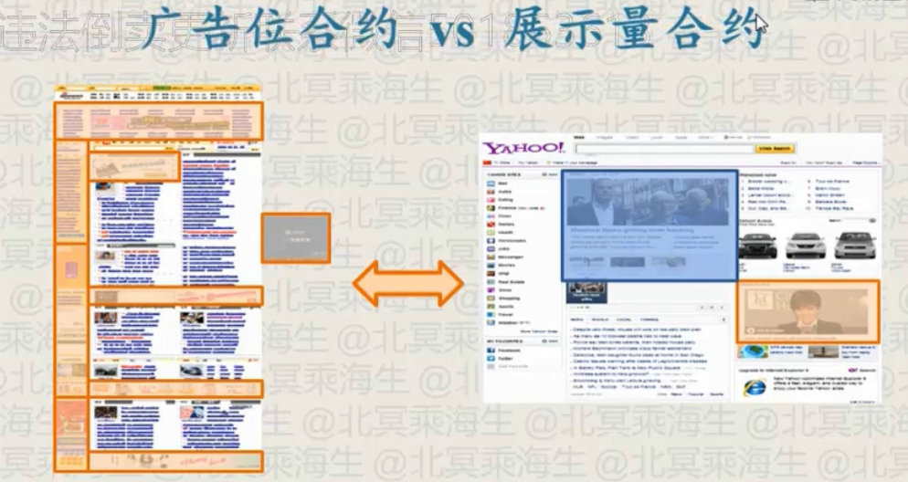

# 计算广告

## Intro
### 商业化相关问题
+ 商业模式探索
+ 流量变现
+ 数据变现
+ 用户增长

### 免费模式
本质：能够个性化传播信息的产品，售价都会趋向其边际成本

example：
- 网站、应用：边际成本 $\approx$ 0
- 手机、电视：边际成本 $\approx$ 量产成本(举例：红米)

目的：获得其他资产，通过后向渠道变现

### 互联网三项可变现资产
- 品牌：根据用户熟悉的形象提高付费内容的**关注程度**
- 数据：根据用户偏好提高付费内容**投放效率**
- 流量：在正常(organic)内容里夹带**付费(sponsor)内容**

### 行业协会
#### iab(Interactive Advertising Bureau)
+ 在线广告供给方的行业协会，推动数字化营销行业的发展
+ 制定市场效果衡量标准和在线创意广告的标准
+ member: Google, Facebook, Yahoo, Microsoft
#### American Association of Advertising Agencies
+ 主要的协议是关于广告代理费用的收取约定，避免恶意竞争
+ 主要集中在创意和客户服务，在线业务是一部分
+ member: Ogilvy & Mather, JWI, McCann等，Dentsu等非4A会员的大公司但也被列为4A公司
#### Association of National Advertisers
+ 主要代表广告需求方的利益（也有媒体和代理会员）
+ member: AT&T,P&G,NBA etc

### 数据
#### 交易数据
业务流程中必须记录的数据

example
+ 电信：通话记录、话费
+ 银行：存取款、利息
+ 医疗：病例

特点
+ 数据规模中等
+ 一致性要求极高
#### 行为数据
业务流程中非必须记录的数据

example：
+ 互联网后台日志

特点：
+ 数据规模巨大
+ 一致性要求相对较低

### 广告形式
#### 偏直接效果型
+ Banner
+ Textual
+ Email Direct Marketing (EDM)
#### 偏品牌触达型
+ video ad
+ rich-media ad
+ 开屏广告
#### 移动广告
+ Banner
+ 开屏 (for branding)
+ 推荐墙
+ 信息流广告
#### 激励性广告
+ 下载返现
+ rewarded video(看视频得游戏道具)
#### 泛广告商业产品
+ 团购
+ 网址导航

### 核心挑战
计算广告的核心问题，是为一系列用户与环境的组合，找到最合适的广告投放策略以优化整体广告的利润

优化的是一组广告，主要是优化收入

$ eCPM = r(a,u,c) = \mu(a,u,c) \cdot v(a,u,c) $

$\mu(a,u,c)$ 点击率

$v(a,u,c)$ 点击价值

### 如何标识一个用户？
+ PC Web / Mobile Web环境 
    - cookie：存续性差，跨域时需要映射
+ iOS应用
    - IDFA：存续性好于cookie，但iOS10有更严格的政策(需要用户许可)
+ Android应用
    - Android ID： 存续性好于IDFA：
    - IMEI：在中国有部分使用
+ 无以上场景
    - FingerPrint (IP + User Agent): 存在http头中，可作缺省标识

### 用户模型的转化漏斗

### 在线广告的主要结算方式

CPC: 最主流，最合理，别的模式都需要第三方监控

CPS: cost per sale

#### CPA/CPS的问题与合理场景
存在的问题：
- 由供给方同时负责优化点击和转化率，并非普适的合理模式
- 存在劫持、代销等多种相应的灰色手段
- 用于优化的数据对于单个广告主来说严重不足
适用的场景：
- 转化流程一致且规范的广告市场
- 例：淘宝客（转化流程为淘宝统一提供）、APP下载（转化
流程在 Apple Store或 Google Play

#### CPA(cost per action) & oCPM(optimize CPM)
oCPM 按CPM结算，但不按CPM优化，按照CPA优化

## 商业化体系
### 商业化体系六大算法问题
A1: 特征提取
A2: 微观优化
A3: 宏观优化
A4: 受限优化
A5: 强化学习
A6: 重定向
### 商业化体系六大产品问题
+ 供需接口
    - 广告主（Campaign）概念上对应于广告主的一次投放合同，其中包括了预算、时间范围等基本信息。
    - 广告组（Ad Group）对应于一个具体的广告投放策略，主要是设定受众定向条件和出价。
    - 广告创意（Creative）则是最终展示出来的素材，可能在同一个组策略下有不同尺寸的创意存在。

+ 竞价机制
+ 数据运营
+ 标签体系
+ 程序化交易
+ 原生广告

### 商业化产品系统框架

离线处理：慢，但可处理数量小
在线处理：快，可处理数量大

Web-scale技术问题比较

#### 广告系统特点
+ 高并发、低延迟的要求
+ 同时关注QPS和Latency
+ 数据处理的规模很大
    -（用户、环境、信息）三元组上的数据建模
+ 数据处理的速度优先于精度
+ 主流程的一致性要求不高

#### 后告系统有什么设计原则？
+ 建立弱一致性系统的设计思维方式
    - eg: Near-line page fetcher
+ 大量数据尽量环形单向流动
    - 避免集中读写形成的单点性能瓶颈
+ 在线时不要发生与关系型数据库的交互
    - 增删改查的传统需求实际上不存在
+ 充分利用开源社区的成熟技术

#### 开源软件的优势和顾虑
优势
+ 大量细分使用场景都有开源方案
+ 大型互连网公司的开源产品经过充分测试

顾虑
+ 需要仔细甄别好的和不太好的开源项目
+ 在遇到深层次bug时无能为力

核心业务逻辑不应该选择开源，eg.排序,语义检索

#### 商业化产品系统架构统一框架

广告库和ETL使用了关系型数据库

Thrift: 协调不同coding language

商业化产品系统架构分解

### 商业化产品六大系统技术
+ 流量接入
    - 代码和SDK
+ 投放引擎
    - 高并发服务
+ 候选查询
    - 实时索引
+ 特征存储
    - Nosql database
+ 离线学习
    - 分布式计算
+ 在线学习
    - 流式计算

### 主要广告产品优化目标分解

## theory
### 最优化问题
#### 无约束最优化问题
$$ min\ f(x)$$
思路：
+ 目标函数不可/不易求导
  + 下降单纯形法(Ameoba变形虫法)
+ 目标函数易求导
  + 梯度下降法
  + 批处理模式：训练集上的梯度分解为各个样本梯度的和，可以并行实现
    + 牛顿法：先定方向后定步长
    + 拟牛顿法 (Hession不正定) BFGS,L-BFGS(省空间)
    + Trust region: 先确定步长后定方向
  + 串行模式：随机梯度下降法(SGD)
#### 带约束最优化问题
$$ min\ f(x)$$
$$ s.t.\ g(x)\leq 0, h(x) = 0$$
方法：
+ 拉格朗日法
### 文档的表示与相似度量
词袋(Bag of Words, BoW): 用关键词TF-IDF组成的矢量来表示文档
$$d = (x_{1},x_{2},...,x_{M})^T$$

TF-IDF:
    - TF: term frequency
    - IDF: inverse document frequency
  
$$IDF(m) = log(N/DF(m))$$

## 用户增长
### 基础：用户转化漏斗
- 原则：整个漏斗过程用于优化一个唯一的目标
- 作用：将该目标分解为若干比率的乘积，便于发现问题并优化
- 示例：
  
- 常见度量
  - 转化率：激活数与点击数的比
  - ｛次日/七日/月｝留存率：某日激活的用户中，｛次日/七日/月｝后活跃的用户占比
  - ｛日/月｝活跃用户（DAU, MAU）:每｛日/月｝活跃的独立用户数
  - 用户时长：每个活跃用产平均消耗的时间

### 找到增长障碍：多维报表分析
Data Cube：

什么是数据魔方？

用户可以较灵活选择维度组合，得到定制化报表;为人工决策提供便利

技术方案:
OLAP数据库

开源方案:
Saiku + MySQL

### 驱动新产品特征：A/B测试
多维情况下，魔方里大部分区域数据非常稀疏
- 极端情形：对于新Feature，需要主动分配测试流量
  
某维度上的两个选项（例如两个不同的模型），数据并不是完全可比，
因此，我们需要一个主动的A/B测试框架，以便
- 主动分配流量給新的产品特征
- 保证对比实验的各组在数据上完全可比
- 尽可能在同样的流量规模上容纳更多的实验
  
A/B测试并不是万能的

用户产品过于依赖数据会丧失对关键创新的把握
- 汽车无法从“跑得更快的马”进化而来（例：Zynga）

多数情形下，需要测试的可行组合太多，必须先经过人的筛选，或更复杂的E&E策略
- 例：每天数十万的新闻，哪些有可能最受用户欢迎？

博弈性场景无法通过A/B测试获得可靠结论

A/B测试最适合的场景：
理性产品、被动反应场景

## 合约广告
用户属性广告
#### 广告位（CPT）合约
与线下广告交易类似的传统模式

供给方产品：广告排期系统
- 帮助媒体自动执行多个合同的排期
- 广告没有复杂的动态决策，因此可以将素材直接插入页面

流量选择的维度
- 时间段、地域、轮播

典型场景
- 高曝光广告位，开屏广告，应用市场头部位置，导航网址

#### 展示量合约与担保式投送
展示量合约
- 基于合约的广告机制，有时未完成约定量要向广告商补偿
- 多采用千次展示付费（Cost per Mille, CPM）方式结算

担保式投送（Guaranteed Delivery, GD）引擎
- CPM方式要求广告投送由服务器端完成决策
- 三大技术基础：受众定向、流量预测、在线分配

典型场景
- 视频广告、富媒体广告、品牌条幅广告

展示量合约以人群为基础，更先进

防天窗广告：服务器down的时候的打底广告

只有CPT广告不用服务器，节约成本

#### 多个合约如何满足：在线分配问题
##### 流量预测
可视为query为a，对流量进行检索的反向查询问题

对供给节点进行倒排索引和查询的过程

预测过程
- 给定a，首先通过u的索引找出所有符合条件c的集合
- 对每个$\mu$估计$r(a,\mu)$，并根据$p_{\mu}(eCPM)$得到a在$\mu$上胜出的百分比p(a,2)，并将a的流量累加p(a,2) ・#$impression_{\mu}$
  
##### 在线分配问题框架

##### 在线分配典型问题

**基于对偶算法的紧凑分配方案**

紧凑分配方案（Compact Allocation plan）
- 变量数正比于|A|，而非|E|或|I|
- 分配策略最好是无状态的，这样可以避免服务器之间的同步

由$\alpha$恢复$\beta$和分配变量$x$：

由历史数据求解上述问题规模太大，需要对数据作一些采样以便更高效地得到分配方案。

**启发式的High Water Mark算法**

离线规划
- 令每个供给节点i的剩余supply等于预测量$r_{i} \leftarrow s_{i}$
- 将每个a按照I(a)中所有供给流量做升序排列，确定分配优先级
- 按照分配优先级对每个a解下式得到其投放率$\beta_{a}$：
  $\sum _{a\in I(a)} min \{{r_i,s_i,\beta_i}\} = d_a$
- 对I(a)中的每个i，令$r_i \leftarrow r_i - min{r_i,s_i\beta_a}$

在线分配

- 对某次展示,$\{a_1，…，a_J\}$为按照分配优先级排序的所有满足要求的广告
- 将上面的广告按投放率随机分配其展示机会

**NGINX**

轻量级Web服务器 / 反向代理服务器
- 专为性能优化面开发，可支持数万并发
- 内存和CPU占用较少

Nginx + FastCGI
将主要业务逻辑在FastCGI中用C语言实现

其他产品选择：Apache

**Zookeeper**
解決分布式应用中的一些数据管理问题
- 集群管理、分布式应用配置项的管理等
- 理论基础是著名的Paxos算法

集群管理
- 将宕机、网络断链、新机器加入等迅速通知每台Server并重新分配流量
- 用Zookeeper的Watch机制很容易实现

#### 频次控制
问题定义
- 限制各$(a,\mu)$组合在一定时间周期的展示量

问题特性
- 频次存储的的规模是有上界的。$(a,\mu)$组合总数不会超过时间周期内的展示总数。
- 生成用$(a,\mu)$对应的key时，不需要处理冲突，因此不需要哈希结构。
- 专用的、轻量级的内存表比大多数No-SQL数据存储方案更实用。

CPM里频次控制很重要

#### Experimentation Framework
哪些场景需要线上A/B测试？
- 广告系统的升级
- 广告算法的改进
- 创意或定向策略的优化

实验框架的设计原则
- 任何一组对比实验，其他的条件都应该相同
- 线上流量容纳尽可能多的实验

### 用户画像
#### 受众定向

受众定向即为(a, M, C)打标签的过程
- 上下文标签可以认为是即时受众标签
标签的两大主要作用
- 建立面向广告主的流量售卖体系
- 为各估计模块（如CTR预测）提供特征
  

常见受众定向方式
+ 地域定向（Geo-targeting）
+ 人口属性定向（Demographical targeting）
  - 年龄、性别、教育程度、收入水平
  - 可监测，难获得，对效果意义有限
+ 频道定向（Channel targeting）
+ 精确位置定向（Hyper-local Targeting）
  - 利用蜂窝信息或者GPS获得精准位置，适用于020广告主）
+ 上下文定向、行为定向

  
受众定向标签体系
+ 结构化标签体系
  - 按照某分类法（Taxonomy）制定一个层次标签体系，父节点与子节点在人群覆盖上是包含关系。
  - 主要用于面向品牌广告的受众定向，特别常用于GD系统中。
+ 非结构化标签体系
  - 根据某类定向需求设置标签，标签并不能为同一个分类体系中所描述
  - 适用于多种目标、特别是效果目标并存的广告主的精准流量选择要求
- 关键词
  - 按照搜索或浏览内容的关键词划分人群
  - 非结构化，容易理解，但操作和优化不容易

标签体系一般设计思路

分行业制定标签体系
- 掌握各行业用户决策逻辑，依此制定标签体系
- 不必拘泥于完备的分类法（Ontology）

行业化标签体系举例
- 汽年行业：伱格→车型→品牌
- 电商行业：单品、单品、单品！
- 游戏行业：对每款游戏拓展竞品
- 母婴行业：孩子的年龄

**上下文定向**

根据用户正在浏览的页面和其他信息投送广告

举例：

地域定向、频道/URL定向，页面内容定向

常用方法：
- 用规则将页面归类到一些频道或主题分类
- 提取页面中的关键词
- 提取页面入链锚文本中的关键词
- 提取页面流量来源中的搜索关键词
- 用主题模型将页面内容映射到语义空间的一组主题上

半在线（Near-line）抓取系统

- 用在线cache系统存储url->特征表以提供实时访问
- 不预先加载任何cache内容，对cache中不存在的url，立刻返回空特征，同时触发相应的页面爬虫和特征提取
- 设置cache系统合适的失效时间以完成特征自动更

文本主题模型

问题：
- 发现一组文档中抽象的主题（topics）

输入：
- 一组文档：$\{ d_1,d_2,..,d_N \}$
- 文档矩阵：$\{n_{n1}, n_{n2},..., n_{nM}\}$
- 文档矩阵：$\{x_{nm}\}_{N \times M}$

输出
- 各文档得T个主题上的强度$\{n_{n1}, n_{n2},..., n_{nT}\}$

常用文本主题模型
- LSA(Latent Semantic Analysis)
- PLSI(Probabilistic Latent Semantic Indexing)
- 词嵌入模型

#### 行为定向
决策行为
- 转化（Conversion）、预转化（Pre-conversion）
- 对应着非常明确的用户兴趣，价值最高

主动行为
- 搜索（Search）、广告点击（Ad click）、搜索点击（Search click）
- 在明确意图支配下主动产生的行为，价值也很高

半主动行为
- 分享（Share）、网页浏览（Page View）
- 量最大，用户意图较弱，但也有一定价值

被动行为
- 广告浏览（Ad View）
- 负面的加权因素

用户ID
- 最重要的数据，一串0前面的那个1
- 稳定、精确的用户ID能大幅提高行为数据使用效率

社交关系
- 可以用与用户兴趣的平滑：当某个人的行为不足，无法进行精准的行为定向时，可以考虑借鉴其社交网络朋友的行为和兴趣

行为定向建模

行为定向数据组织

Session log
- 将各种行为日志整理成以用户ID为key的形式，作为各数据处理模块的输入源，可以将targeting变成局部计算

行为定向两种长期特征累积方式
- 滑动窗方式
$x'(d) = \sum^{D}_{\delta=0} x(d-\delta)$
- 时间衰减方式
$x'(d) = \alpha x'(d-1) +x(d)$

人口属性定向

人口属性
- 由于监测的原因，实践中主要使用的是性别、年龄
- 在传统广告中为人群选择的主要语言

人口属性定向
— 以性别定向为例，为二分类问题

$g = arg max \ _{g\in \{M,F\}} p(g|b)$

— 需要有一定数量的标注样本，特征则来自用户行

### 分布式计算平台

**FLUME**
- 高可用的，高可靠的，分布式的海量日志采集、聚合和传输的系统
- 数据源：console、text、 Thrift-RPC、tail, syslog
- 数据目的：console、dfs、Thrift-RPC, syslog TCP
- 其他产品选择
  - Scribe, Chukwa, KafKa

**Redis**
- 一个KV存储系统
  - Value可以支持string、list、set、zset、Hash
  - 支持push/pop、add/remove等操作示高性能，使用简单，提供多种语言API
- 注意事项
  - 避免让批量写影响在线服务中的读性能一尽量用自更新的方式减少数据输入
- 其他产品选择：Memcached
  
### 合约广告优缺点
优点
- 有投放量的保证，确保人群触达
- 有时可以有竞品排他服务
- 活动类营销可以利用CPT位置获得冲击式曝光

缺点
- 很难利用精细的用户数据
- 溢价相对较高，媒体作弊相对容易

### 合约广告的利用和选择
主要的合约广告产品
- 综合或垂直门户的首页广告位
- 视频网站贴片广告具
- 移动应用开屏广告

应该如何选择
- 宣传活动的品牌广告，可以选择高曝光的CPT广告 
- 日常品牌触达广告，可以结合受众购买CPM广告

### 广告监播
产品目的
- 广告主委托第三方公司，对实际发生的展示或点击数目进行核对
- 主要适用于按CPM结算的合约广告 
- 按CPC、CPA结算的效果广告对此需求不大

难点
- 人口属性、地域等的监测
- 样本与总体之间的校正

### 广告安全
广告投放验证（Ad verification）
- 确认品牌的安全性，防止广告出现在对品牌有伤害的页面上。（
例：优衣库出现在钓鱼岛新闻上）
- 页面内容不符合品牌诉求，则展示与品牌无关创意
- 与广告监播不同，重点在于阻止不恰当展示的发生
- 可以Pre-bid进行

可视性（Viewability）验证
- 验证广告展示的曝光程度
- 判断浏览器是否对广告创意发生了渲染过

## 竞价广告
精细数据变现
### mechanical design
#### 竞价交易问题